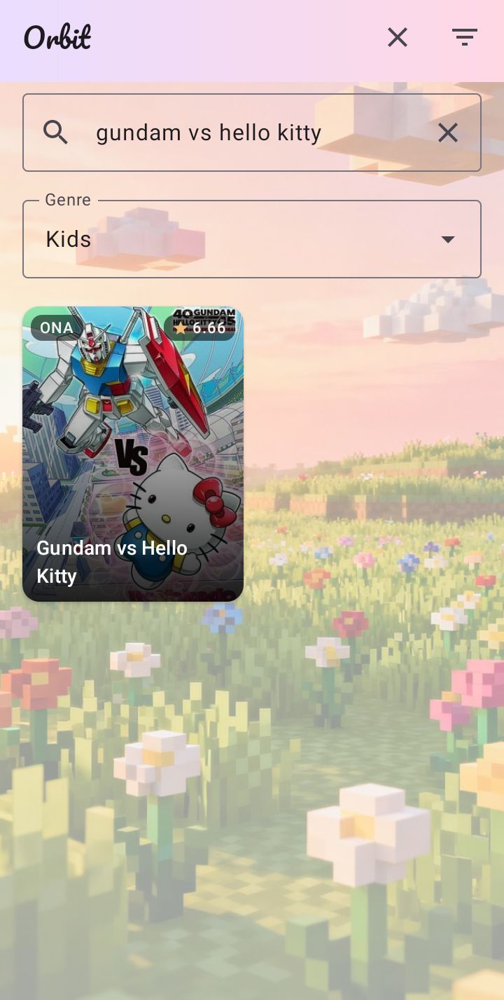
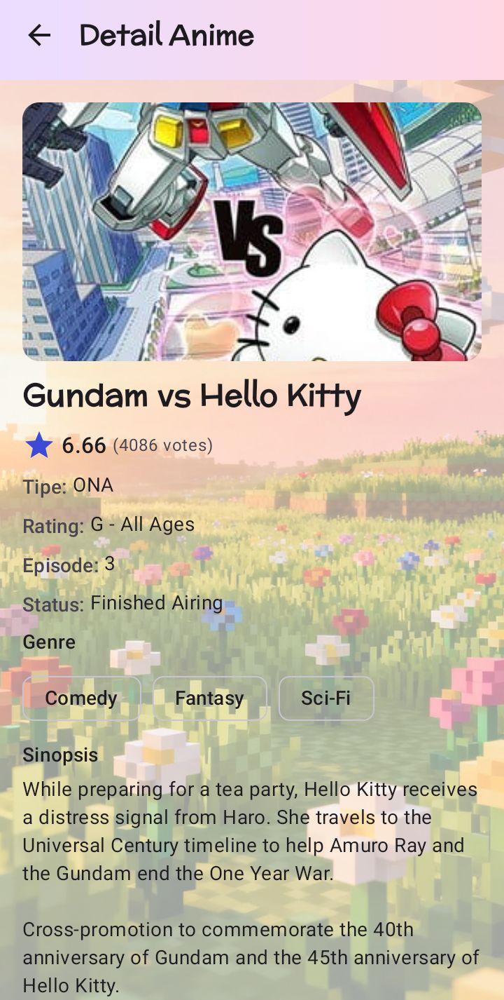

# Orbit

Aplikasi mobile pencarian anime berbasis Kotlin dan Jetpack Compose. Pengguna dapat mencari anime
berdasarkan judul, memfilter berdasarkan genre, melihat daftar hasil dalam grid, dan membuka halaman
detail berisi genre, rating, jumlah episode, status, dan sinopsis. Data diambil secara dinamis dari
Tenrai API (REST, kompatibel skema Jikan v4).

## Screenshot

| Home Screen                             | Detail Screen                               |
|-----------------------------------------|---------------------------------------------|
|  |  |

## Struktur MVVM

Source code berada di `app/src/main/java/com/pemmob/orbit/` dan dipisahkan menjadi tiga lapisan:

```
com.pemmob.orbit/
├── data/
│   ├── remote/
│   │   ├── dto/AnimeDto.kt        # Model: hasil parsing JSON (Data)
│   │   ├── TenraiApiService.kt    # Kontrak endpoint Retrofit (Data)
│   │   └── RetrofitClient.kt      # Pembuatan instance HTTP (Data)
│   └── repository/
│       └── AnimeRepository.kt     # Satu-satunya source data (Data)
├── ui/
│   ├── home/
│   │   ├── HomeUiState.kt         # Wadah state layar utama
│   │   ├── HomeViewModel.kt       # Logic + state layar utama (ViewModel)
│   │   └── HomeScreen.kt          # Tampilan layar utama (View)
│   ├── detail/
│   │   ├── DetailUiState.kt       # Wadah state layar detail
│   │   ├── DetailViewModel.kt     # Logic + state layar detail (ViewModel)
│   │   └── DetailScreen.kt        # Tampilan layar detail (View)
│   ├── components/                # Komponen UI bersama
│   │   ├── AnimeCard.kt           # Kartu poster overlay (judul, tipe, rating)
│   │   ├── GenreDropdown.kt       # Filter genre
│   │   ├── OrbitBackground.kt     # Background gambar + scrim + TopAppBar gradasi
│   │   └── LoadingErrorViews.kt   # State loading, error, dan kosong
│   ├── navigation/
│   │   └── NavGraph.kt            # Rute: home dan detail/{malId}
│   └── theme/                     # Custom Theme dan Typography
│       ├── Color.kt               # Palet Orbit (indigo + amber)
│       ├── Type.kt                # Font Pacifico (logo) dan McLaren (judul)
│       └── Theme.kt               # OrbitTheme (light/dark)
└── MainActivity.kt                # Entry point: Theme + NavGraph
```

Alur datanya satu arah:

1. View (`HomeScreen`, `DetailScreen`) hanya menggambar dan meneruskan aksi pengguna. Tidak ada
   pemanggilan API di Composable.
2. ViewModel (`HomeViewModel`, `DetailViewModel`) menyimpan state di `StateFlow` (`HomeUiState`,
   `DetailUiState`: query, hasil pencarian, loading, error, data detail). Setiap perubahan state
   memicu recomposition Compose secara otomatis (state-driven UI).
3. Repository (`AnimeRepository`) adalah satu-satunya lapisan yang berbicara ke jaringan. Ia
   memanggil `TenraiApiService`, membungkus hasilnya dalam `Result` (`AnimePage` berisi daftar
   item + penanda halaman berikutnya) dan mengembalikan data atau exception-nya ke ViewModel.
4. `DetailViewModel` membutuhkan `malId` dari rute navigasi, sehingga ia dibuat melalui
   `DetailViewModel.Factory` yang diteruskan sebagai argumen `viewModel(factory)` di `NavGraph`.

## Penggunaan API

Base URL: `https://api.tenrai.org/v1/` (didefinisikan di `TenraiApiService.BASE_URL`, instance
Retrofit dibuat di `RetrofitClient` dengan converter Gson dan interceptor logging).

| Kebutuhan                | Endpoint               | Parameter utama                                                  |
|--------------------------|------------------------|------------------------------------------------------------------|
| Pencarian + filter genre | `GET /anime`           | `q` (judul), `genres` (id genre), `page`, `limit=24`, `sfw=true` |
| Detail anime             | `GET /anime/{id}/full` | `id` = `mal_id` dari item yang dipilih                           |
| Daftar genre             | `GET /genres/anime`    | —                                                                |

Respons selalu dibungkus objek `data`: pencarian mengembalikan `data: [...]` plus
`pagination: { has_next_page, ... }` (dipakai infinite scroll), sedangkan detail mengembalikan
`data: {...}` tunggal. Field yang dipakai aplikasi: `mal_id`, `title` / `title_english`, `type`,
`score`, `rating`, `status`, `episodes`, `synopsis`, `genres[]`, dan `images.jpg.large_image_url`
untuk poster (dimuat dengan Coil).

Izin `INTERNET` dan `ACCESS_NETWORK_STATE` dideklarasikan di `app/src/main/AndroidManifest.xml`.

Font yang dibundel (`app/src/main/res/font/`, lisensi di `app/src/main/assets/`): Pacifico dan
McLaren di bawah SIL Open Font License 1.1.

## Link Video

